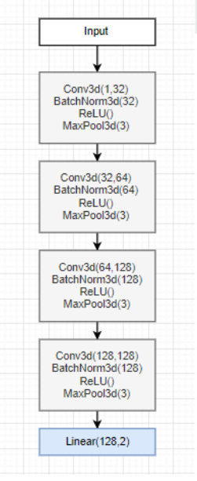
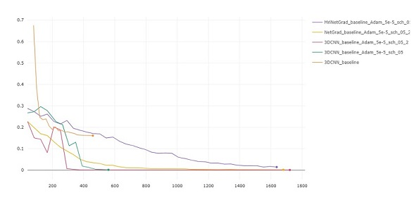
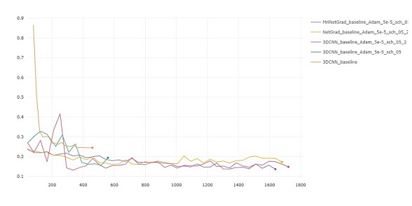
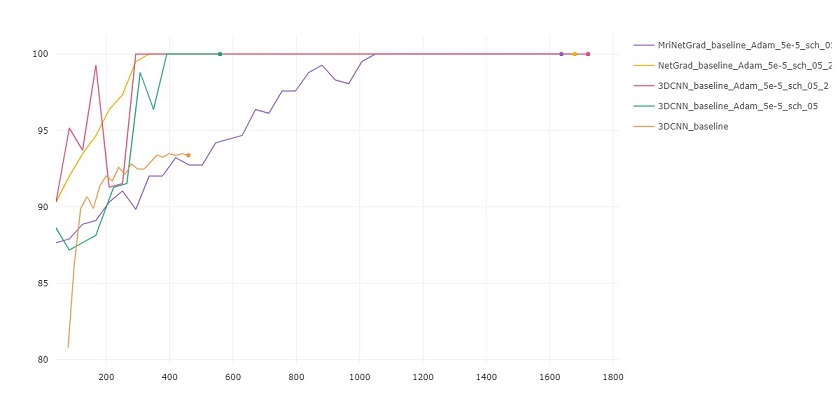
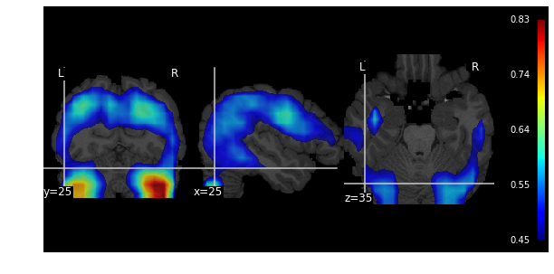
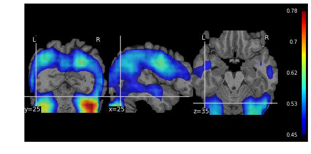
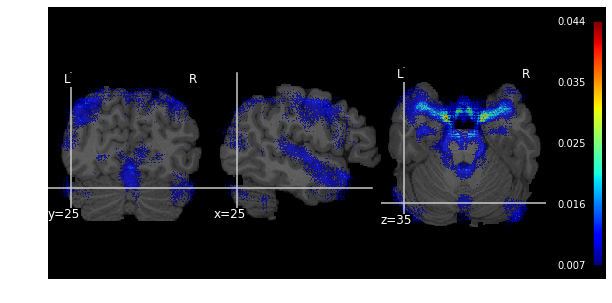
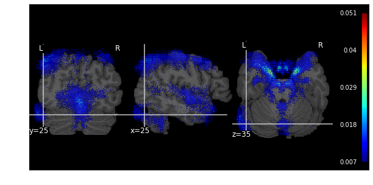
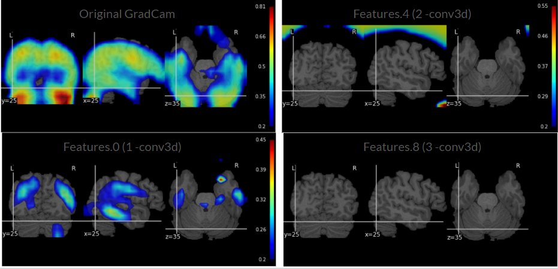
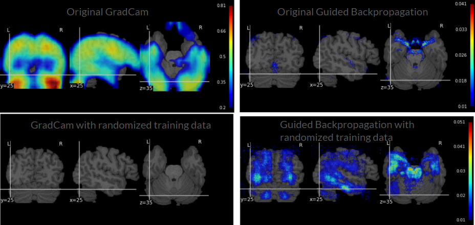

# CrystalNeuroimaging
## Interpretation of 3D CNNs for Brain MRI Data Classification
Using HCP T1-weighted MRI data we tried classification of 3DCNN for task of gender patterns recognition. And then we applied different methods of interpretation to research and  undestand of gender-related brain differencies. 

## DATASET
 Dataset - Human Connection Project (HCP).
 We worked on the full-sized T1 MPI images preprocessed in `Freesurfer` according to the HCP pipeline.
 Data contain 517 subjects, including 210 men and 307 women.
 
 ## CNN Model

To train the 3D CNN models use 

```bash
3DCNN.ipynb
```



[CometMl:](https://www.comet.ml/polina/mri-interpretation/view/uw5eiUdqrH5ArXAKBHGA1FKIr)

Train and validate loss

 

Train and validate accuracy

 


## GradCAM

Interpretation with Grad CAM:
  - Mean over Female
  


  - Mean over Male
  


## Guided backpropagation

Interpretation with Guided backpropogation:
  - Mean over Female
  


  - Mean over Male
  


## Model Randomization Test 
### GradCam



### Guided backpropagation


## Date Randomization Test 



